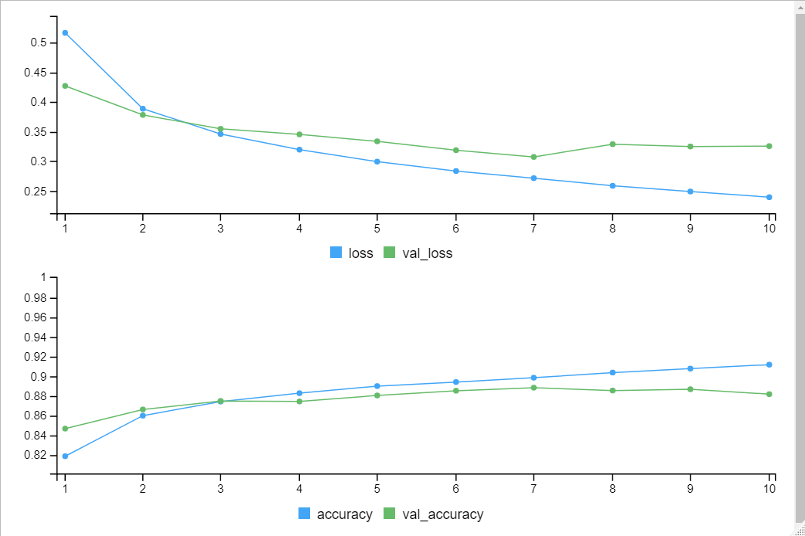

# ImageClassificationAlg
Portfolio project - Basic Image Classification Algorithm using Keras and Tensorflow in Rstudio

## Accuracy and Loss Results of the built model

## Visual overview of 25 clothing items and the model's ability to identify each (i.e. green indicates correct guess, red indicates incorrect guess)

